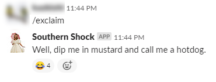
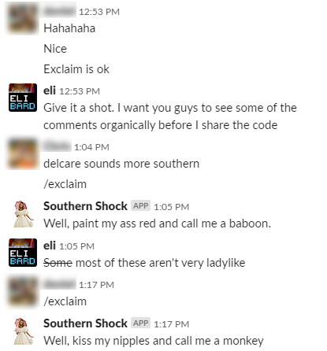

# What is this?
This is a "Southern Exclamation" expression generator for Slack, which is meant to be served through Firebase as a Function.


## Okay, but... why?
You need to find your motivation somewhere, and I get motivation from making my friends laugh... or at least fake laugh out of politeness, bless their hearts.


# Installation

## JS Things

Navigate to the /functions directory and install the packages with NPM or Yarn

`npm install` or `yarn install`

## Firebase

Create a Firebase account. (Google gives generous free-tier usage of their platform, so don't hesitate)

Install the firebase-tools package:

`npm install -g firebase-tools`

Navigate to the / directory of the project.

Next, log into Firebase:

`firebase login`

Iinitialize a new Firebase project:

`firebase init`

When prompted with "Which Firebase CLI features do you want to set up for this folder?" highlight "Functions" and press &lt;space&gt; to select it. Next, choose an existing project, create one, or whatever you gotta do. Go through the next steps. It will ask you if you want to overwrite the package.json file, the file generated file is exactly the same as the one in the repo, so either y or N is ok. **Do not overwrite the index.js file** though!

I don't remember so many steps. Oh jeez, it also prompts you to install dependencies with npm too.

(optional) Run the Firebase local emulator to test:

`firebase emulators:start`

(optional) Send a POST request to the emulator (GET also works for simple testing purposes, but Slack uses POST):

`curl -d '' -X POST http://localhost:5001/<YOUR PATH>`

Deploy to Firebase:

`firebase deploy`

For definitive information, please read the [Firebase docs on creating functions](https://firebase.google.com/docs/functions/write-firebase-functions)


## Slack setup
(This section is not a definitive process. Please refer to [Slack's documentation](https://api.slack.com/start) for missing details)

Navigate to [App Home](https://api.slack.com/apps?new_app=1) and click Create New App
Fill out App Name and Development Slack Workspace

On the app's information page, under Settings => Basic Information => Building Apps for Slack => Add features and functionality, select Slash Commands

Slash Commands => Create new Command

Fill out the form as you wish. For reference, the values I used were:
- **Command:** /exclaim
- **Request URL:** https://us-central1-southernshock-&lt;SECRET&gt;.cloudfunctions.net/&lt;SECRET&gt;`
- **Short Description:** Southern Exclamation
- **Usage Hint:** &lt;NONE&gt;

From the App page, scroll down to Display Information where you can set:
- App name
- Short description
- App icon
- Background color

For the app's icon, might I suggest a nice Southern Belle? At the time of writing this, you need to use a square image between 512px and 2000px.

Finally, choose "Install your app to your workspace"


# Usage
From Slack, type the command you chose (e.g. `/exclaim`) into the chat window of your choice. Your app will hit the Firebase Function and add the message to the chat.



# Customizing output

Creating your own output follows the flow of:
1. Create a probability
2. Give the probability a weight and action
3. Create words and an action


Probabilities with weights and actions can be seen below.

```
const probabilities = [
  {
    weight: 1,
    action: getSentence
  },
  {
    weight: 2,
    action: buildFromVerbObjectCombo
  },
  {
    weight: 7,
    action: buildFromVerbAndObject
  }
]
```
The weight is divided by the total of all weights to determine the chance of it being randomly selected. The action is the function called which creates the output.

Because total weight is 10, the chance of these probabilities being chosen are 1/10 (10%), 2/10 (20%), and 7/10 (70%), respectively.

All actions utilize the `getRandomFrom(array)` function, which randomly select one array element.

```
const foods = [
  'cornbread is',
  'BBQ is',
  'pecan pie with vanilla ice cream is',
  'fried chicken is'
]

const buildFromFood = () => {
  return `I think we can all agree that ${getRandomFrom(foods)} the best food on Earth` // NOTE: the best food on Earth is actually Mexican food. Sorry, y'all. It's nacho cuisine.
}
```


# Misc

## Do Southern people talk like this?
Each and every one of them with absolutely zero exceptions.

## Could I change this to be less Southern-centric?
Oh, heaven's no, but bless your heart for asking, Sugar.

## How can I not use this?
Do the opposite of the contents of this README.md file.

## How can I donate a lot of money to you for creating this extremely useful, and dare I say, educational piece of software?
This question is the most frequently asked of all the questions. Please send the cash directly to me. Please keep it in denominations of 100 dollars or greater.
